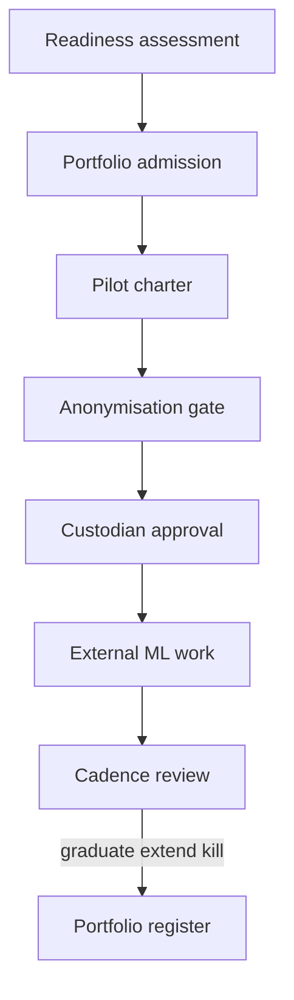

# Pilotspan

**Source:** `ai-in-decentralized+ai/AI+Bible/`
**Domain:** `ai-decentralized`
**One-liner:** An enterprise AI pilot portfolio desk that scores organisational readiness, enforces five-point anonymisation gates, assigns custodians and dream-team talent, and graduates only pilots that prove value on real-world data.
**Wedge:** Mid-market firms running their first 3–10 ML pilots across departments — where piecemeal tools already failed — starting with one sponsored portfolio and mandatory anonymisation before any production data touch.
**Positioning:** Organisational AI transition ops, not a model factory. The AI+Bible argues department-level standalone tools without funding and governance produce costly fixes; APMF pilots should unlock unexpected impact; ATF builds talent; ethics requires Aggregate/Remove/Top-Bottom/Group/Hash anonymisation scoring.

## Market research synthesis

### Thesis from source

The AIcompany Machine Learning Guide (“AI Bible”) pairs theory with management frameworks for organisational transition. It distinguishes Advanced Analytics from AI when systems plan and reason on ML predictions, and stresses generalisation, overfitting, and supervised/unsupervised flavours — but the commercially distinctive material is the management stack: organisation structure, hardware/SOA, data strategy, talent (ATF), and business processes, plus the Pilot Management Framework (APMF).

Piecemeal department deployments without sufficient funding yield inconsistent results and costly remediation; differing departmental data models (transactional vs promotional customer views) slow or kill ML efforts. Formal governance and senior sponsors are required. Agile Scrum is advised for ML initiatives without demanding full org conversion overnight. SOA/containers and cloud reduce time-to-market for pilots; hardware myths (ML on an iPhone) are called out with practical pilot specs.

Data Security & Ethics insists on anonymous data strategies scored on five points: Aggregate, Remove, Top and Bottom Coding, Group, and Hash digests (common in healthcare). Bias can enter via correlated features such as zip codes even when race is omitted; credit risk and recidivism examples show life-impacting stakes. Harvard/HBR figures cited: less than 1% of unstructured data analysed, more than 70% of employees with excess access, 80% of analyst time spent discovering and preparing data. Defensive and offensive data strategies plus Data Custodians improve quality and control.

APMF starts innovation initiatives that may have unexpected org-wide impact: confirm priority opportunities, resolve conditions and pilot setup, demonstrate success on new real-world data. ATF covers hiring, developing talent, and assembling dream teams where even one-hour domain specialist commitment can matter.

### Buyer & economic model

- **Primary buyer:** Chief Digital Officer or Head of Innovation sponsoring an AI pilot portfolio with CFO visibility.
- **Users:** pilot product owners, data custodians, privacy reviewers on anonymisation gates, HR/talent partners, scrum masters, executive sponsors.
- **Budget owner / value metric:** innovation / transformation budget; value metric is pilots graduated with evidenced business value and zero anonymisation-gate breaches.
- **Competing status quo:** shadow data-science projects, slideware readiness surveys, and tool sprawl without portfolio kill/graduate decisions.

### Domain constraints

- **Regulatory / trust / safety:** sector privacy; ethics for high-stakes scoring (credit, HR, justice-adjacent); anonymisation before cross-team data use.
- **Data sensitivity:** pilots often want production data too early — gates must block.
- **Change-management realities:** agile pockets inside waterfall enterprises; sponsors must be named or pilots stall.

## Business requirements

- BR-1: Every pilot must have a named executive sponsor and charter before consuming production data.
- BR-2: Organisational readiness must be scored across structure, infrastructure, data, talent, and process pillars before portfolio admission.
- BR-3: Anonymisation gates must evaluate Aggregate, Remove, Top/Bottom Coding, Group, and Hash strategies with a pass threshold before data release to the pilot team.
- BR-4: Data Custodians must be assigned for datasets used in pilots with accountability for quality and access.
- BR-5: Talent assignments must record dream-team roles including minimum domain-specialist commitment.
- BR-6: Pilots must define success metrics on real-world holdout data, not only training accuracy.
- BR-7: Portfolio reviews must force graduate / extend / kill decisions on a published cadence.
- BR-8: Piecemeal department tools outside the portfolio must be discoverable as shadow AI for remediation.
- BR-9: Hardware/cloud readiness checks must prevent impossible pilot scopes without blocking cloud experiments.
- BR-10: Model-training execution is out of scope; Pilotspan governs and gates, it does not train.
- BR-11: Ethics exceptions (e.g., inability to anonymise adequately) must block rather than waive by default.
- BR-12: Audit exports must show gate history for any graduated pilot.

## User stories

Canonical user stories live in sibling [USER_STORIES.md](USER_STORIES.md).

## System design

### Overview

Pilotspan is a portfolio and gate system: readiness assessments feed admission; charters and talent plans structure work; anonymisation and custodian approvals unlock data; cadence reviews graduate or kill. Training clusters and model registries remain external.

### Actors & boundaries

- **Actors:** sponsors, pilot owners, custodians, ethics reviewers, talent partners, auditors.
- **Trust boundary:** Pilotspan stores metadata, scores, and approvals; raw training data stays in governed stores.
- **Human-in-the-loop points:** readiness adjudication, anonymisation pass/fail, graduate/kill, ethics blocks.

### Core capabilities

1. **Readiness assessment (five pillars)**
2. **Pilot charter and portfolio cadence**
3. **Anonymisation gate (five techniques)**
4. **Data custodian workflows**
5. **Talent / dream-team assignments**
6. **Graduate / extend / kill decisions**
7. **Shadow AI discovery register**

### Conceptual data

- **Primary entities:** Organisation, ReadinessAssessment, Pilot, Charter, AnonymisationGate, DatasetApproval, Custodian, TalentAssignment, PortfolioDecision, ShadowAiSystem.
- **Critical events:** assessed, chartered, gate passed/failed, data approved, reviewed, graduated, killed.
- **Retention / audit needs:** gate and decision history retained for audit of graduated systems.

### Integrations (conceptual)

- **Systems of record:** HRIS (talent), data catalogue, IAM, project tooling (Jira), ML platform (status only).
- **Upstream signals:** shadow IT discovery, DPIA outcomes.
- **Downstream actions:** IAM group provisioning after gate pass, budget release, kill notifications.

### High-level architecture

### Success metrics

- **Leading:** % pilots with passed anonymisation gates before data access; readiness score coverage; dream-team fill rate.
- **Lagging:** graduation rate with evidenced business KPIs; shadow AI systems retired; ethics incidents on pilot data.

## OpenAPI skeleton

Canonical HTTP surface lives in sibling [openapi.yaml](openapi.yaml). Summary:

- **Base path:** `/v1/...`
- **Auth:** API key / Bearer JWT.
- **Resource groups:** ReadinessAssessments, Pilots, AnonymisationGates, Custodians, TalentAssignments.
