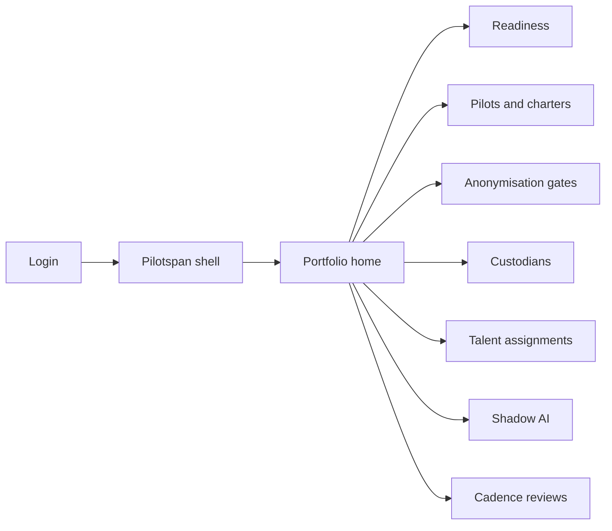
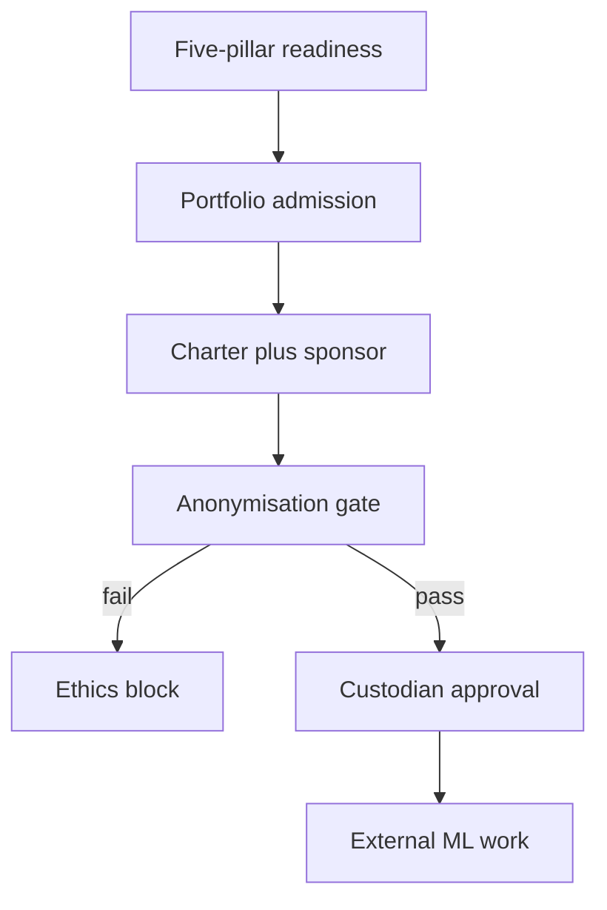

# Pilotspan — Web app

**Product:** [PRODUCT.md](./PRODUCT.md)
**Primary surface:** Enterprise AI pilot portfolio desk (readiness → gates → graduate/kill)
**Secondary surfaces:** Ethics anonymisation scoring worksheet; shadow AI discovery register
**Design thesis:** Pilotspan is an organisational transition desk for first-wave ML pilots — the UI metaphor is a gated portfolio runway with five-point anonymisation passport stamps, not a model-training IDE. Visual language is cool chalk-blue on graphite with passport-green for gate pass and brick for ethics blocks; dream-team slots read like casting sheets, not HR dashboards. The brand wordmark sits as a quiet runway mark on every portfolio and graduation screen so sponsors know whose APMF cadence they are funding.

## UX research synthesis

### Category peers (best-in-class)

- **Productboard / Aha! portfolio:** Forced prioritise and kill/graduate decisions on a cadence. Steal: publish graduate/extend/kill reviews (BR-7); reject feature-roadmap chrome that ignores anonymisation.
- **Collibra / Alation stewardship:** Named custodians and dataset approvals. Steal: custodian as first-class gate before access (BR-4); reject catalog-only browsing without pilot charter.
- **OneTrust / privacy anonymisation tooling:** Technique checklists for de-identification. Steal: Aggregate / Remove / Top-Bottom / Group / Hash as scored passport (BR-3); reject single “anonymised ✓” checkbox.
- **Jira Align / SAFe PI planning:** Named sponsors and capacity for agile pockets in waterfall orgs. Steal: sponsor + charter required before production data (BR-1); reject full org SAFe conversion as prerequisite.

### Patterns to adopt / reject

- **Adopt:** Five-pillar readiness before admission; five-technique anonymisation pass threshold; real-world holdout metrics for graduation; dream-team including one-hour domain slots; shadow AI remediation; ethics block by default (BR-11).
- **Reject:** Training notebooks as home (BR-10); purple AutoML marketing; waive anonymisation for “urgent demos”; accuracy-only success; cream-terracotta consulting brochure aesthetic.

### Trust, density, and workflow constraints from PRODUCT.md

Sponsor + charter before production data (BR-1). Readiness across structure/infra/data/talent/process (BR-2). Anonymisation five-point gate (BR-3). Custodians accountable (BR-4). ATF talent recorded (BR-5). Real-world metrics (BR-6). Cadence decisions (BR-7). Shadow AI discoverable (BR-8). Hardware/cloud sanity checks (BR-9). No training execution in-product (BR-10). Ethics blocks not waivers (BR-11). Audit gate history on graduates (BR-12).

## Information architecture

### Nav model

### Roles → default home

| Role | Default home | Why |
|------|--------------|-----|
| Executive sponsor | Portfolio home | Fund/kill duplicates (BR-7) |
| Pilot product owner | Pilots and charters | APMF readiness path |
| Data custodian | Custodians | Approve dataset use (BR-4) |
| Privacy / ethics reviewer | Anonymisation gates | Five-point scoring (BR-3) |
| Talent partner | Talent assignments | Dream-team fill (BR-5) |
| Auditor | Cadence reviews / export | Gate history on graduates (BR-12) |

### Cross-links to OpenAPI resources

| Nav area | OpenAPI tags / resources |
|----------|---------------------------|
| Readiness | ReadinessAssessments |
| Pilots and charters | Pilots |
| Anonymisation gates | AnonymisationGates |
| Custodians | Custodians |
| Talent assignments | TalentAssignments |

## Screen inventory

### Portfolio home

- **Purpose:** Answer “which pilots are gated, graduating, or should be killed?” in one composition.
- **Entry:** Sponsor post-login.
- **Layout regions:** Brand + org switcher; portfolio kanban (admitted / gated / building / review); anonymisation breach alerts; shadow AI count; next cadence date.
- **Primary actions:** Open pilot; schedule review; export portfolio brief.
- **Empty / loading / error:** Empty = start readiness assessment; error = retry with request id.
- **BR / story ties:** BR-7, BR-8; sponsor stories.

### Readiness assessment

- **Purpose:** Score structure, infrastructure, data, talent, process before admission.
- **Entry:** Nav → Readiness; admission gate.
- **Layout regions:** Five-pillar scorecards; evidence notes; hardware/cloud check panel; admit/hold decision.
- **Primary actions:** Complete assessment; admit to portfolio; hold with gaps.
- **Empty / loading / error:** Incomplete pillars block admission.
- **BR / story ties:** BR-2, BR-9.

### Pilot charter

- **Purpose:** APMF-tied charter with sponsor, success metrics on real-world data.
- **Entry:** Admitted pilot; owner default.
- **Layout regions:** Charter template; sponsor identity; real-world KPI fields; ML platform status (external link only).
- **Primary actions:** Submit charter; request data access (blocked until gates); register holdout metrics.
- **Empty / loading / error:** Missing sponsor = cannot request production data (BR-1).
- **BR / story ties:** BR-1, BR-6; pilot owner stories.

### Anonymisation gate worksheet

- **Purpose:** Score Aggregate, Remove, Top/Bottom Coding, Group, Hash; pass threshold required.
- **Entry:** Data request; ethics default.
- **Layout regions:** Five technique scores; correlated-feature bias notes (e.g. zip); pass/fail seal; exception = block not waive.
- **Primary actions:** Score; fail with rationale; pass unlocks custodian step.
- **Empty / loading / error:** Fail state brick; no silent waive (BR-11).
- **BR / story ties:** BR-3, BR-11; ethics reviewer stories.

### Custodian approvals

- **Purpose:** Assign custodians; approve/reject dataset use; log quality issues.
- **Entry:** After gate pass; nav → Custodians.
- **Layout regions:** Dataset list; custodian owner; access request queue; quality issue log (prep-time waste visibility).
- **Primary actions:** Approve; reject; log quality defect; shrink excess access.
- **Empty / loading / error:** No custodian assigned = block.
- **BR / story ties:** BR-4; custodian stories.

### Talent / dream-team board

- **Purpose:** ATF roles including bookable one-hour domain specialists.
- **Entry:** Nav → Talent; charter section.
- **Layout regions:** Role slots; fill rate; domain specialist calendar hooks; contractor vs internal balance.
- **Primary actions:** Assign; book one-hour consult; flag gaps to sponsor.
- **Empty / loading / error:** Underfilled dream team warns but may not hard-block charter submit (soft gate with sponsor visibility).
- **BR / story ties:** BR-5; talent partner stories.

### Cadence review (graduate / extend / kill)

- **Purpose:** Force portfolio decisions with evidenced business value.
- **Entry:** Cadence calendar; sponsor review.
- **Layout regions:** Pilot evidence pack; real-world KPI vs training accuracy; decision panel; audit trail.
- **Primary actions:** Graduate; extend; kill; require more evidence.
- **Empty / loading / error:** Accuracy-only packs flagged insufficient (BR-6).
- **BR / story ties:** BR-6, BR-7, BR-12.

### Shadow AI register

- **Purpose:** Discover piecemeal department tools outside portfolio for remediation.
- **Entry:** Nav → Shadow; home alert.
- **Layout regions:** Discovered systems; owner; remediation status; invite into portfolio or retire.
- **Primary actions:** Claim; remediate; retire.
- **Empty / loading / error:** Empty = monitored-clear with last scan time.
- **BR / story ties:** BR-8.

## Key flows

1. **Admit and unlock data** — readiness → admit → charter + sponsor → anonymisation five-point → custodian approve → external ML work (BR-1–BR-4).

2. **Cadence decision** — evidence real-world KPIs → graduate / extend / kill (BR-6, BR-7).

3. **Ethics hard block** — inadequate anonymisation → block; no default waive (BR-11).

4. **Shadow remediation** — discover department tool → claim or retire → optional portfolio onboarding (BR-8).

5. **Graduate audit export** — gate history + decisions packaged (BR-12).

## Design system

### Tokens (CSS variables)

- `--color-ink: #E8EEF4` — text on dark
- `--color-graphite-950: #0C1016` — ground
- `--color-graphite-900: #161C26` — panels
- `--color-chalk: #7BA3C9` — readiness / runway accent
- `--color-passport: #3D9B6E` — gate pass
- `--color-brick: #C4503E` — ethics block / kill
- `--color-amber: #D9A441` — extend / incomplete pillars
- `--color-steel: #8A97A8` — secondary
- `--color-brand: #A8C4DE` — Pilotspan wordmark
- `--font-display: "Newsreader", serif` — portfolio titles
- `--font-body: "IBM Plex Sans", sans-serif`
- `--font-mono: "IBM Plex Mono", monospace` — gate scores, pilot ids
- `--space-1`…`--space-8`: 4px scale
- `--radius-sm: 4px`; `--radius-md: 8px`
- `--motion-stamp: 180ms ease-out` — gate passport stamp
- `--motion-kill: 220ms ease-in-out` — kill decision
- `--motion-admit: 200ms ease-out` — portfolio admit
- Atmosphere: subtle runway stripe texture; no neural-net wallpaper.

### Typography & brand

- Newsreader for portfolio and review titles; Plex for ops density.
- Brand on portfolio and graduation screens.
- Login: brand hero; headline (“Graduate pilots that prove value”); one CTA.

### Do / don’t

- **Do:** Five-point anonymisation UI; force graduate/extend/kill; show real-world metrics; deep-link out for training.
- **Don’t:** Embed notebooks; waive ethics; purple AutoML glow; accuracy-only graduation.

### Accessibility & domain trust cues

- AA+ contrast; gate fail uses text + brick, not colour alone.
- Live regions for cadence decisions and ethics blocks.
- Focus order: readiness → charter → gate → custodian → review.

## Component patterns

- **FivePillarScorecard** — structure/infra/data/talent/process.
- **AnonymisationPassport** — Aggregate→Hash scored stamps.
- **SponsorCharterLock** — production data unlock condition.
- **DreamTeamSlot** — ATF role with one-hour domain booking.
- **CadenceDecisionPanel** — graduate / extend / kill.
- **ShadowAiRow** — discovered non-portfolio system.
- **BiasProxyNote** — correlated-feature discussion capture.
- **GraduateAuditPack** — gate history export.

## Out of scope for v1 web

- Model training / AutoML execution (BR-10); full HRIS replacement; consumer apps; headset clients; agency multi-tenant white-label beyond single enterprise org.
